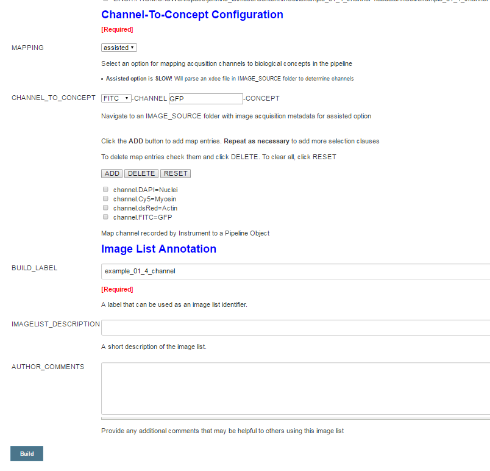

Prerequisites and Software Installation
=======================================

Prerequisites
-------------

### Java JDK

Jenkins-CI is a Java application and as such it requires that [Java](https://www.java.com/en/download/help/index_installing.xml) is installed on the workstation that will be configured as the Jenkins server. It is recommended that a recent version of the Java JDK is installed ( our Jenkins-LifeSci implementation has been successfully tested with Java version 1.8.x)

### Groovy SDK

Groovy (<http://groovy-lang.org/>) is the native scripting language in Jenkins. Most of the provided scripts are implemented in Groovy. The latest version of the Groovy SDK (2.4.x as of this writing) is recommended. Jenkins-CI can [directly install tools](https://wiki.jenkins-ci.org/display/JENKINS/Tool+Auto-Installation) and one of them is Groovy. If you don’t already have Groovy installed on your server you can configure Jenkins to install Groovy as needed.

### Git

Git (<https://git-scm.com/> ) is a mature, actively maintained open source project for source code version control. You will need to have [git installed](https://git-scm.com/book/en/v2/Getting-Started-Installing-Git) on the computer where Jenkins-LSCI will be installed. This will allow you to install and update the Jenkins-LSCI code directly from its git repository.

Alternatively you can download a zip archive from the git repository and expand it in your JENKINS\_HOME folder

### H2 Database

[H2](http://www.h2database.com/html/main.html) is a Java SQL database. In Jenkins-LSCI it is used to manipulate large CSV files as database tables. H2 is included as a jar file in this distribution.

### CellProfiler

CellProfiler is free open-source software designed to enable biologists without training in computer vision or programming to quantitatively measure phenotypes from thousands of images automatically. It can be downloaded from <http://cellprofiler.org/releases/> .

Download and install the latest stable version (all of our code has been developed and tested with CellProfiler v2.1.2)

For HP image processing on a Linux cluster, CellProfiler and its library dependencies must be installed and correctly working on the destination Linux cluster. Detailed instructions are provided on the CellProfiler wiki page <https://github.com/CellProfiler/CellProfiler/wiki/Source-installation-%28Linux%29>

Jenkins-LSCI Installation
-------------------------

The provided installation instructions are for a Windows workstation or server, but can be easily adapted to other platforms. Jenkins-LSCI and all the software libraries used are Java based, and so they should be cross platform compatible.

### JENKINS\_HOME: Create Folder and Environment Variable

Jenkins-CI will look for a JENKINS\_HOME environment variable on first run and will create the required installation file structure in that folder. This is preferred than installing Jenkins-CI in its default location and then needing to clone the Jenkins-LSCI project into it.

1.  Create a folder in a suitable location on your file system where you will install Jenkins-CI. For example create a C:\\DEVTOOLS\\Jenkins folder

2.  Create a JENKINS\_HOME environment variable for your operating system. This variable should point to the folder you just created. For example JENKINS\_HOME=C:\\DEVTOOLS\\Jenkins

### Jenkins-LSCI: Clone Git Project

**Before installing or running Jenkins for the first time** clone the Jenkins-LSCI git repository into the JENKINS\_HOME folder.

1.  From the command line, change the working directory to JENKINS\_HOME

2.  Then execute the command:

> git clone <https://github.com/Novartis/Jenkins-LSCI.git>

This should clone the required Jenkins-LSCI jobs, plugins, scripts, and other resource folders into the JENKINS\_HOME folder.

After cloning the Jenkins-LSCI repository you should have the following JENKINS\_HOME subfolders.

-   jobs

-   plugins

-   scriptler

-   userContent

This minimal installation will allow you to run the Jenkins-LSCI job examples once Jenkins is installed and configured.

You can either [configure the global site variables](#_Global_Variables) now or wait till later. The system comes preconfigured with defaults that use examples in the ‘userContent’ folder for testing. To use data from your own site requires that you customize the site.properties file for your installation environment.

### Jenkins-CI: Download and Install

Now you should be ready to install Jenkins-CI and take the system for a spin!

Download a [recent version of the Jenkins-CI war](https://jenkins.io/index.html) file and place it in the JENKINS\_HOME folder.

Jenkins-LSCI Minimal Configuration
----------------------------------

### Jenkins-LSCI: Server Startup

1.  Open a command line window and change your working directory to JENKINS\_HOME.

2.  Launch Jenkins-CI by executing java -jar jenkins.war

3.  Once it launches, visit http://localhost:8080/ in your browser to get to the dashboard.

4.  Review the console for any error messages (there should not be any if all goes well!)

On Windows, you can even choose to install [Jenkins as a service](https://wiki.jenkins-ci.org/display/JENKINS/Installing+Jenkins+as+a+Windows+service) afterwards.

At this point you should have a Jenkins-LSCI server running on you workstation and accessible from your browser at <http://localhost:8080/> 

The dashboard should look similar to the one below:

*Note*: You will navigate to the various configuration options described below by clicking links on the left side menu or by entering a specific URL in your browser.

1.  Go to: <http://localhost:8080/configure>

    1.  Or click on the ‘Manage Jenkins’-&gt;’Configure System’ links

2.  In the ‘Jenkins Location’ section enter a Jenkins URL that includes the name of your system instead of ‘localhost’

3.  **Click the &lt;Save&gt; button to save your changes**. This is important as it addresses a [bug](https://issues.jenkins-ci.org/browse/JENKINS-28466) in Jenkins that can prevent some of the Jenkins-LSCI jobs from working correctly with a minimally configured Jenkins!

*Note*: This initial server is not configured yet for Security and Groovy. As a result it will not function correctly until the next two steps are completed.

### Initial Security Configuration

We will next configure a minimal security server that will allow us to test-run the Jenkins-LSCI jobs, but will not be appropriate for a production environment.

Review the Jenkins-CI wiki on how to [secure Jenkins-CI](https://wiki.jenkins-ci.org/display/JENKINS/Securing+Jenkins) for a production use.

#### Allow HTML Formatting

1.  Go to <http://localhost:8080/configureSecurity>

    1.  Or click on ‘Manage Jenkins’-&gt;’Configure Global Security’ links

2.  In the ‘Markup Formatter’ drop down box select ‘Safe HTML’

This allows HTML to be used in the description of projects and parameters and is required for correct display of Jenkins-LSCI job forms.

#### Allow Scriptlet Execution

Access the scriptlet scripts and allow execution on those that are used as build steps in Jenkins-LSCI jobs as follows:

1.  Go to: <http://localhost:8080/scriptler>

    1.  Or click on the ‘Scriptler’ link

2.  Click on each of the following scripts and check the ‘Permission’ checkbox as shown in the example below to ‘allow execution by user with RunScript permission’

    1.  RenameBuildArtifact

    2.  cpSgeTaskArray

    3.  trackListMetadata

    4.  unZipArchive

    5.  writeXMLProperties\_scriptlet

### HTTP Proxy Configuration

HTTP proxy configuration is required if your Jenkins server will be accessing the internet via a proxy server. Proxy configuration is **required for installing Groovy via Jenkins** and for updating required plugins from the Jenkins **update center.**

1.  To access the HTTP proxy configuration go to: <http://localhost:8080/pluginManager/advanced>

2.  Provide a Server name and port for your HTTP proxy

3.  Click the &lt;Advanced&gt; button and provide a test URL to validate your proxy settings

The proxy settings might not take effect until the Jenkins-CI server is restarted.

So **exit and restart the Jenkins-CI server**.

1.  To stop the server type: <http://localhost:8080/exit> in your browser and click on the ‘Try Posting’ button

2.  Or go to the command line console and hit &lt;Ctrl&gt;-C to exit the batch script

3.  Restart Jenkins-CI by executing java -jar jenkins.war

### Automatic Groovy Installation

Before executing Jenkins-LSCI jobs that utilize Groovy scripts, we need to install Groovy on the server. Jenkins-CI has the ability to auto-install certain tools such as Groovy.

1.  Go to: <http://localhost:8080/configureTools>

    1.  Or click on ‘Manage Jenkins’-&gt;’Global Tool Configuration’ links

2.  In the ‘Groovy’ section click &lt;Add Installer&gt; and select ‘Install from Groovy Site’

3.  Select the most recent version of Groovy

4.  Name this Groovy installation: Default

5.  Click on the &lt;Save&gt; or &lt;Apply&gt; buttons to save your changes

This will insure that before a Groovy script is executed Jenkins-CI will download and install the requested version. Note the Groovy installation directory:

JENKINS\_HOME/tools/hudson.plugins.groovy.GroovyInstallation /Default

Jenkins-LSCI Jobs for High Content Screening Image Analysis
===========================================================

To demonstrate the use **of Jenkins-CI as an integration and management platform for life-sciences** research applications, we provide a set of Jenkins-LSCI jobs that in combination with CellProfiler can be used to build an effective infrastructure for image analysis as used in **high content screening** applications.

These related Jenkins-LSCI jobs will enable users to:

1.  Create a library of re-usable CellProfiler pipelines.

    1.  Specifically users will be able to annotate, upload, review and re-use CellProfiler image processing pipelines

2.  Create a library of re-usable CellProfiler image lists

    1.  Specifically users will be able to upload, create and re-use CellProfiler compatible image lists that can be processed through a CellProfiler pipeline

3.  Prepare images for CellProfiler high performance image analysis (CellProfiler batch mode) on a Linux cluster

Jenkins-LSCI Job Summaries
--------------------------

### OS\_CONTRIBUTE\_PIPELINE: Upload a CellProfiler Pipeline

The ‘OS\_CONTRIBUTE\_PIPELINE’ job allows users to annotate and upload a CellProfiler pipeline to the Jenkins server. The build generates a pipeline summary report combining user and internal pipeline annotations. The pipeline is stored on the Jenkins server and can be used by CellProfiler running on the Jenkins or the user’s desktop.

#### Generic CellProfiler Image Analysis Pipelines

The following image analysis pipelines are made available with the Jenkins-LSCI system to provide example starter pipelines. Read the associated [notes](./userContent/cp_pipelines/readme.txt). All pipelines used in Jenkins-LSCI must use the LoadData module to load and associate image files with metadata.

| Pipeline Name          | Utility                                                                     |
|------------------------|-----------------------------------------------------------------------------|
| [Cytoplasmic Intensity](./userContent/cp_pipelines/cytoplasmic_intensity.cppipe) | Determine the cytoplasmic intensity of a fluorescent cell marker            |
| [Translocation protocol](./userContent/cp_pipelines/cytoplasmic_intensity.cppipe) | Determine the nuclear to cytoplasmic ratio of a marker that can translocate |

#### Build Form Example

#### How to test

A few example CellProfiler pipelines can be found under JENKINS\_HOME\\userContent\\cp\_pipelines

Consult the readme.txt file included in the cp\_pipelines folder for some useful information.

You can test the OS\_CONTRIBUTE\_PIPELINE job by choosing a ‘user\_pipeline’ from the example pipelines. The example pipelines are already configured with the required LoadData import module and source image lists served from a Jenkins URL. As result, you don’t have to supply an ‘example\_image\_list’ file.

Click &lt;Build&gt; and review the corresponding build summary report.

### OS\_CONTRIBUTE\_IMAGELIST: Generate a CellProfiler Formatted Image List

The ‘OS\_CONTRIBUTE\_IMAGELIST’ job allows users to create correctly formatted image lists that can be used for processing large number of images through a CellProfiler pipeline. The creation of an image list depends on the correct parsing of imager-specific metadata generated during the image acquisition phase.

-   We provide parsers for InCell and Yokogawa imagers.

In the absence of instrument metadata, image lists can be created using the CellProfiler desktop client and uploaded to the Jenkins server for adaptation to formats compatible with high performance cluster analysis.

#### Build Form example

#### How to test

We provide example InCell and Yokogawa acquisition metadata useful for image list creation in the following folders:

JENKINS\_HOME\\userContent\\cp\_pimageLists\\InCell

JENKINS\_HOME\\userContent\\cp\_pimageLists\\Yokogawa

Consult the readme.txt file included in each corresponding (or example) folder for some useful information.

You can test the OS\_CONTRIBUTE\_IMAGELIST job by generating image lists from the provided example InCell and Yokogawa acquisition metadata files and reviewing the corresponding build summary reports.

#### Test creating Linux adapted image lists

To create an image list adapted for another operating system (such as Linux) or path you need to provide a replacement path for either a part of the current image path or for the entire image path.

As an example, let’s assume that the current image path is:

C:\\CWorkspace\\jenkins\_lsci\\userContent\\InCell\\example\_01\_4\_channel

And that the images can also be found on a Linux path at:

/labdata/InCell/ example\_01\_4\_channel

We could assign a PATH\_MAPPING by replacing the **entire path**

Alternatively, we could remove the common path of the mapping (InCell\\example\_01\_4\_channel) and **replace just the divergent part**:

OS\_CONTRIBUTE\_IMAGELIST is aware of operating system conventions and will replace backward slashes in Windows paths with forward slashes in Linux paths.

### OS\_CELLPROFILER\_BATCH

The ‘OS\_CELLPROFILER\_BATCH’ job allows users to generate correctly formatted CellProfiler task array scripts that can be submitted to a Linux cluster for parallel processing. The job builds take as input a reference to an ‘OS\_CONTRIBUTE\_PIPELINE’ build and a reference to an ‘OS\_CONTRIBUTE\_IMAGELIST’ build. Theses builds define the two inputs for a typical CellProfiler run, the image processing pipeline and the image list.

Due to the unpredictable, local, Linux cluster environment dependencies of a clustered job, the submission process of the task array is left up to the user. In addition, CellProfiler and its library dependencies must be installed and correctly working on the destination Linux cluster.

The task array is currently formatted for the UNIVA grid engine scheduler and it should require little effort to customize for other environments.

‘OS\_CELLPROFILER\_BATCH’ can define how images to be processed on the same compute node are grouped.

1.  If the CellProfiler pipeline does not define a grouping then images are grouped by simply dividing the image list is ‘chunks’ of 12 images per node (can be configures in site.properties)

2.  If the CellProfiler pipeline defines metadata-based grouping of the images (required for correction illumination, time-series, z-stacks and other advanced pipelines) then image list metadata are automatically used to create the specified groups

In addition, ‘OS\_CELLPROFILER\_BATCH’ allows users to select for processing a subset of images from the image list using image list metadata as filtering criteria.

#### Build Form Example

#### Testing Prerequisites

The input to OS\_CELLPROFILER\_BATCH jobs are pipelines and image lists created by the corresponding Jenkins-LSCI jobs :

-   OS\_CONTRIBUTE\_PIPELINE and

-   OS\_CONTRIBUTE\_IMAGE\_LIST

So, you should have at least one of each of these jobs executed before you attempt to build a OS\_CELL\_PROFILER\_JOB.

In addition, a Linux formatted list is required as input. Insure that you create Linux adapted image lists when using the OS\_CONTRIBUTE\_IMAGELIST jobs.

#### How to test

On the OS\_CELLPROFILER\_BATCH build form select from the available options:

-   A PIPELINE reference to previous OS\_CONTRIBUTE\_PIPELINE builds

-   A GENERATED\_IMAGE\_LIST reference to previous OS\_CONTRIBUTE\_IMAGELIST builds

-   (Optionally) in section 4 select a subset of the image list by constructing and adding selection criteria from the available metadata of the list

-   Annotate you build

Click the &lt;Build&gt; button and review the resulting build summary report.

Jenkins-CI: Administration & Maintenance
========================================

Jenkins-CI Wiki
---------------

If you need additional information on administering and securing your Jenkins server, review the Jenkins-CI wiki:

-   <https://wiki.jenkins-ci.org/display/JENKINS/Administering+Jenkins>

-   <https://wiki.jenkins-ci.org/display/JENKINS/Securing+Jenkins>

Jenkins-CI and Jenkins-Plugins
------------------------------

A Jenkins-CI server installation depends on the core Jenkins-CI (<http://jenkins-ci.org>) software that is freely available on the web, and a number of required **plugins** that are also freely available from the Jenkins-CI plugin repository (<https://wiki.jenkins-ci.org/display/JENKINS/Plugins>).

| #### Software        | #### Link                                      | #### Category | #### Comment                                                      |
|----------------------|------------------------------------------------|---------------|-------------------------------------------------------------------|
| Jenkins-CI (Windows) | <http://mirrors.jenkins-ci.org/windows/latest> | Installation  | Download installation software                                    |
| Jenkins-CI (Linux)   | <http://jenkins-ci.org/>                       | Installation  | Download installation package for appropriate version of Linux-OS |

Follow the installation directions relevant to the OS on which Jenkins will be running found on the [Jenkins-CI wiki](https://wiki.jenkins-ci.org/display/JENKINS/Installing+Jenkins)

#### Relative Paths to Jenkins 

We will refer to the Jenkins installation directory as the JENKINS\_HOME. For a typical Windows Jenkins installation JENKINS\_HOME may look like: D:\\DEVTOOLS\\Jenkins

JENKINS\_HOME contains additional folders with standardized names such as:

-   jobs

-   log

-   plugins

-   scriptler

-   userContent

-   users

-   war

-   workspace

Jenkins-LSCI Job Folder Structure
---------------------------------

Jenkins-LSCI jobs are installed in the JENKINS\_HOME/jobs folder.

The configuration file for each job, and the associated scripts and properties are in a corresponding folder with the same name. The typical folder structure is shown in the example below:

JENKINS\_HOME

|\_\_ jobs

> |\_\_ OS\_CONTRIBUTE\_IMAGELIST
>
> |
>
> |\_\_ buildScripts
>
> |\_\_ buildProps
>
> config.xml

Loading New Job Definitions
---------------------------

Note that **while the Jenkins server is running** you can add new job definitions to the JENKINS\_HOME\\jobs folder.

However, for these jobs to appear on your server, you will need **to reload the job definitions**

You can enter the following command [http://\[yourserver\]:\[port\]/reload](http://[yourserver]:[port]/reload) in your browser to reload job configurations.
